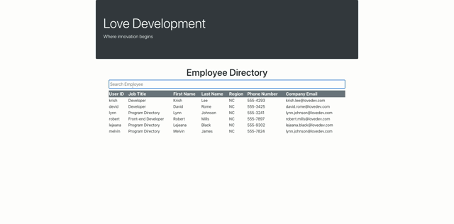

# Employee Directory

## Description:
> This employee directory displays insensitive employee data and allows the user to filter between employees by first name, using React hooks.

## Installation
npm install

node server.js

## Demo

This project was bootstrapped with [Create React App](https://github.com/facebook/create-react-app).

## Available Scripts

In the project directory, you can run:

`yarn start`

Runs the app in the development mode. 
Open [http://localhost:3000](http://localhost:3000) to view it in the browser.

The page will reload if you make edits. 

